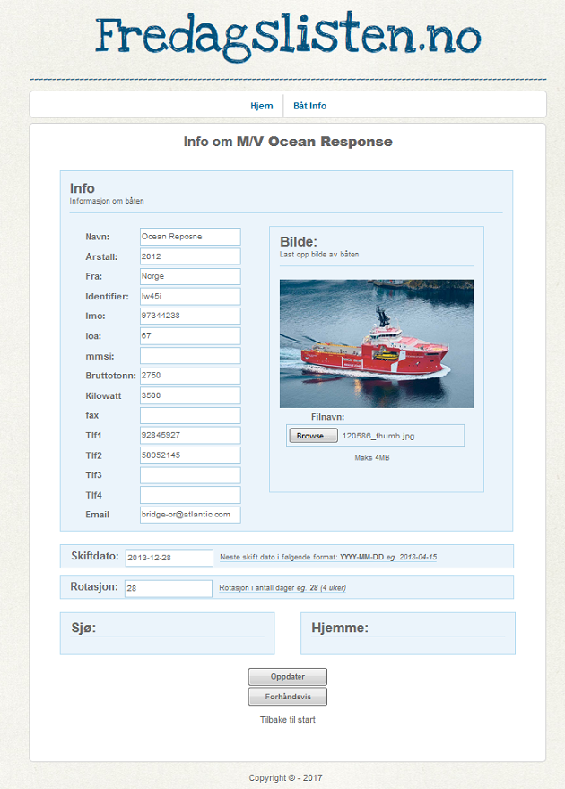

# The relics of a "sailor news" webapp from 2013 

This application was supposed to keep sailors updated on "sailor news" from within the company they worked for.

I created this while working at sea, and got the idea from the captain sending word files around the company.

The idea never materialized though... 

##Basic operation
The sailors themselves was supposed to login to a web interface and upload information regarding their own crew... shifts, names, positions etc.

Every friday the software would automatically generate a PDF newsletter and send it out to all the crew/subscribers.
The crew would then print the newsletter and put it in the messroom.

Below you can get a basic idea of the design.
I never saved the database, hence some data is lost.

Part of the pdf the software would generate every friday:

